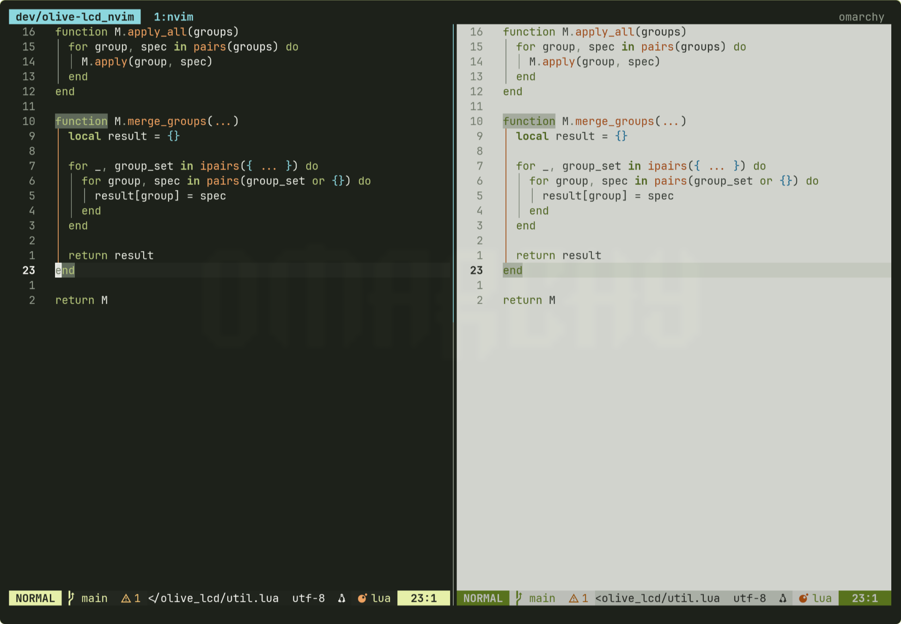

# `olive-crt.nvim`

`olive-crt.nvim` is a neovim colorscheme shaped around a retro olive CRT look, expanded into a readable editor theme with both dark and light variants.




## Features

- dark and light variants driven by `:set background=`
- neovim support for treesitter, diagnostics, LSP references, semantic tokens, and common plugins
- semantic palette roles so colors stay consistent across UI and syntax

## Installation

use your preferred plugin manager.

With `lazy.nvim`:

```lua
{
  "reobin/olive-crt.nvim",
  lazy = false,
  priority = 1000,
  opts = {},
}
```

## Usage

```lua
vim.cmd.colorscheme("olive-crt")
```

Switch between variants with Neovim's built-in background setting:

```vim
set background=dark
colorscheme olive-crt

set background=light
colorscheme olive-crt
```

## Setup

```lua
require("olive_crt").setup({
  transparent = false,
  styles = {
    comments = {},
    keywords = { bold = true },
    functions = {},
    strings = {},
    variables = {},
  },
  plugins = {
    telescope = true,
    gitsigns = true,
    which_key = true,
    cmp = true,
    neo_tree = true,
    oil = true,
    notify = true,
    mini = true,
    treesitter_context = true,
  },
  overrides = {},
})
```

Then load the colorscheme:

```lua
vim.cmd.colorscheme("olive-crt")
```

## Notes

- neovim support targets modern highlight groups such as `@markup.*`, `@lsp.type.*`, `LspInlayHint`, and `Diagnostic*`.
